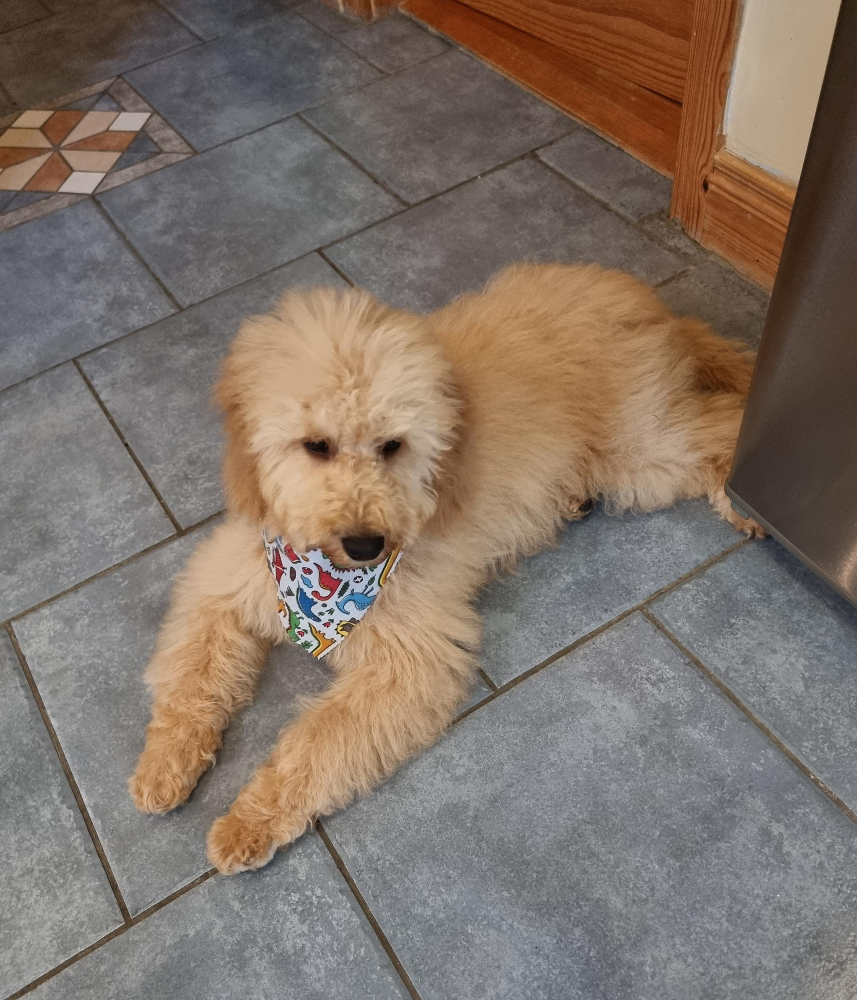

# 5 Color Scheme

This solution extracts the dominant color palette from an image using K-Means clustering. It's a command-line tool that can identify the most prominent colors in a given image and output them in various formats.

## Description

The script, `5cs.py`, takes an image file as input and uses the K-Means clustering algorithm to find a specified number of dominant colors. It preprocesses the image by resizing and sampling pixels to ensure efficient processing. The extracted color palette can be displayed as a swatch, saved as an image, and printed to the console in RGB or HEX format.

## Dependencies

- Python 3
- OpenCV (`opencv-python`)
- scikit-learn (`scikit-learn`)
- NumPy (`numpy`)
- Matplotlib (`matplotlib`)

You can install the required dependencies using pip:
```bash
pip install opencv-python scikit-learn numpy matplotlib
```

## Usage

You can run the script from the command line with various options.

### Basic Example

To extract the 5 dominant colors from the default image and display the palette:
```bash
python "challenges/Emulation/5 color scheme/5cs.py"
```

### Advanced Example

To extract 8 colors from a specific image, resize it for faster processing, save the palette as a PNG, and output the results in JSON format:
```bash
python "challenges/Emulation/5 color scheme/5cs.py" -i path/to/your/image.jpg -n 8 --resize 800x800 --save-palette my_palette.png --json
```

### Command-Line Arguments

- `-i`, `--image`: Path to the input image file.
- `-n`, `--num-colors`: Number of colors to extract.
- `--hex`: Print colors as HEX codes.
- `--json`: Output a JSON summary of the palette.
- `--save-palette`: Save the palette visualization to a PNG file.
- `--max-pixels`: Randomly sample at most N pixels for clustering.
- `--resize`: Resize the image before processing (e.g., `800x800`).

## Sample Output

Running the script with the default image (`qwFWZv8.jpg`) and saving the palette will produce an image like this:



*(Note: The `qwFWZv8.jpg` file in this directory is the default input image and also serves as an example of the kind of image the script can process.)*
